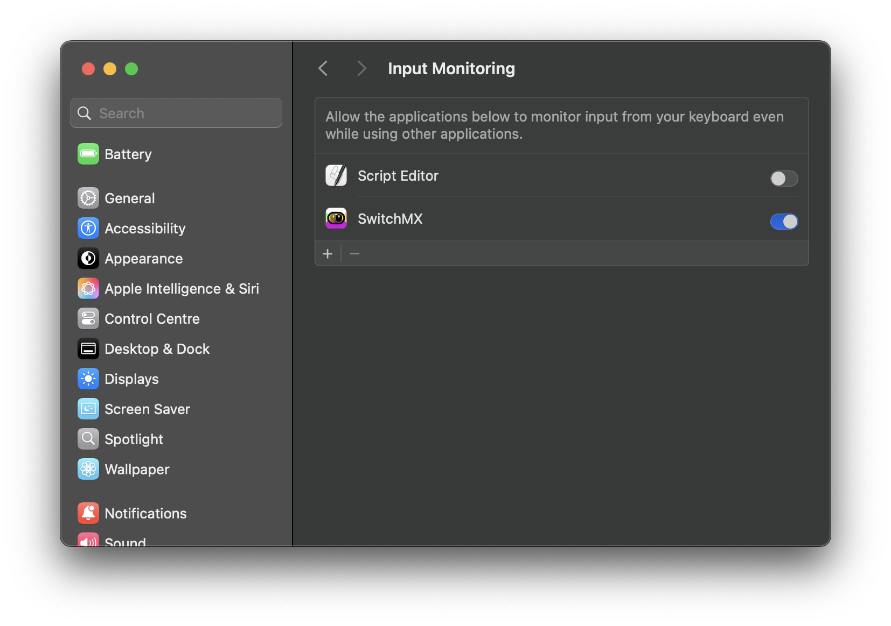
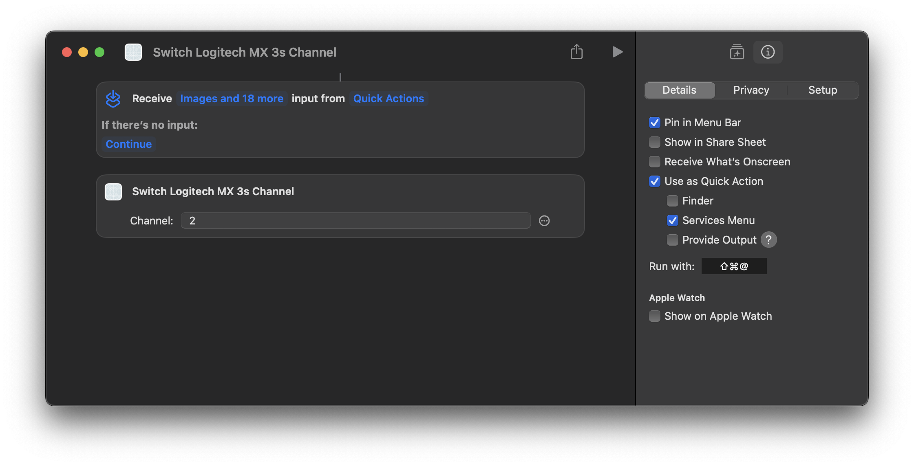

<h1>SwitchMX</h1>

<b>Switch channels on your Logitech MX Master 3S mouse.</b>

 
 
 

SwitchMX allows you to quickly switch to one of the three devices that are connected to your Logitech MX 3S mouse without pressing the physical button.

It's especially helpful to switch back and forth between two Macs.

## Download

Get the [latest download](https://github.com/boyvanamstel/SwitchMX/releases/latest) from the Releases page.

## Setup

SwitchMX needs _Input Monitoring_ to be enabled in Settings &rarr; Privacy & Security &rarr; Input Monitoring to be able to send commands to _Humand Interface Devices_ (HID).

It will request permission when you first use the app.

## Shortcuts

You can use SwitchMX from the menu bar _or_ you can use the built-in support for Shortcuts to quickly send control to a different device with a keyboard shortcut.

_Or_ automatically trigger the shortcut at a certain time or mix it in another workflow.

You don't even have to keep the app running. Shortcuts will launch and quit SwitchMX when it needs it.

## Support

This software is provided "as is" without warranty and support. Use at your own risk.

## FAQ

### Q: Why can't I see SwitchMX in my menu bar?

A: There's limited space in the menu bar on macOS. If you can't find the icon it's likely hidden. Close another app or find another way to make some room for it.

## Other Apps

Visit [dangr.co](https://dangr.co) for more apps.

## License

MIT
